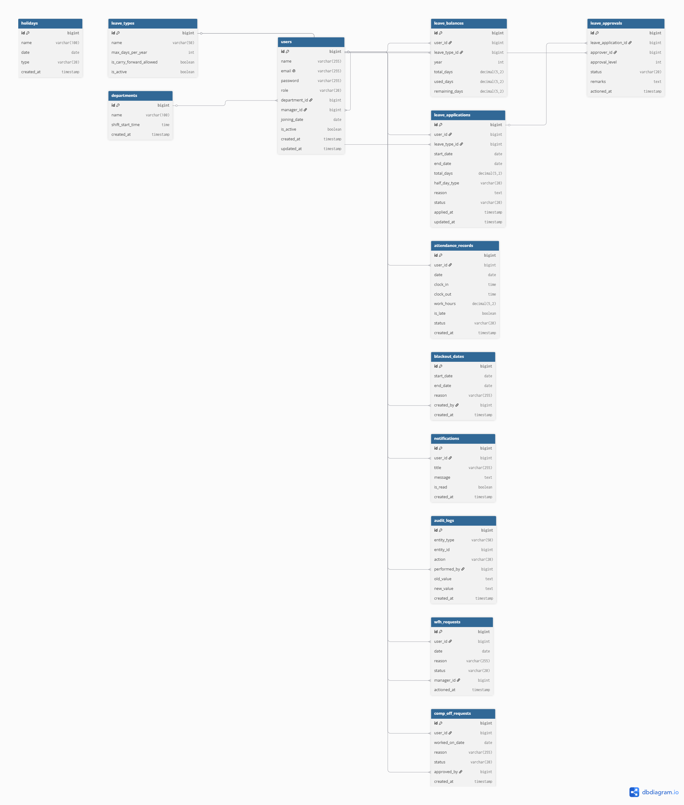

# Database Design Document – Leave Management System

## Entity Relationship Diagram (ERD)

---

## Table Definitions

### `users`
Stores all system users (employees, managers, HR, admins).

| Column | Type | Description |
|--------|------|-------------|
| id | BIGINT (PK) | Unique user identifier |
| name | VARCHAR | Full name |
| email | VARCHAR | Login email (unique) |
| password | VARCHAR | Hashed password |
| role | ENUM(EMPLOYEE,MANAGER,HR,ADMIN) | User role |
| department_id | BIGINT (FK → departments.id) | Department this user belongs to |
| manager_id | BIGINT (FK → users.id) | Self‑referencing manager |
| joining_date | DATE | Date of joining |
| is_active | BOOLEAN | Soft‑delete flag |
| created_at | TIMESTAMP | Row creation time |
| updated_at | TIMESTAMP | Last update time |

### `departments`
Master list of departments.

| Column | Type | Description |
|--------|------|-------------|
| id | BIGINT (PK) | Department ID |
| name | VARCHAR | Department name |
| shift_start_time | TIME | Default shift start |
| created_at | TIMESTAMP | Creation timestamp |

### `leave_types`
Defines available leave categories.

| Column | Type | Description |
|--------|------|-------------|
| id | BIGINT (PK) | Leave type ID |
| name | VARCHAR | Leave name |
| max_days_per_year | INT | Maximum days per year |
| is_carry_forward_allowed | BOOLEAN | Can unused days be carried over? |
| is_active | BOOLEAN | Soft‑delete flag |

### `leave_balances`
Tracks each user's leave entitlement per year.

| Column | Type | Description |
|--------|------|-------------|
| id | BIGINT (PK) | Balance record ID |
| user_id | BIGINT (FK → users.id) | Employee |
| leave_type_id | BIGINT (FK → leave_types.id) | Leave type |
| year | INT | Calendar year |
| total_days | DECIMAL | Total days entitled |
| used_days | DECIMAL | Days used |
| remaining_days | DECIMAL | Remaining balance |

**Unique Constraint:** `(user_id, leave_type_id, year)`

### `leave_applications`
Stores leave requests submitted by employees.

| Column | Type | Description |
|--------|------|-------------|
| id | BIGINT (PK) | Application ID |
| user_id | BIGINT (FK → users.id) | Applicant |
| leave_type_id | BIGINT (FK → leave_types.id) | Type of leave |
| start_date | DATE | First day |
| end_date | DATE | Last day |
| total_days | DECIMAL | Total days |
| half_day_type | ENUM(MORNING/AFTERNOON) | Half-day type (or null) |
| reason | TEXT | Reason |
| status | ENUM(PENDING/APPROVED/REJECTED/CANCELLED) | Current state |
| applied_at | TIMESTAMP | Submission time |
| updated_at | TIMESTAMP | Last update |

### `leave_approvals`
Audit trail for each approval level (Manager → HR).

| Column | Type | Description |
|--------|------|-------------|
| id | BIGINT (PK) | Approval record ID |
| leave_application_id | BIGINT (FK → leave_applications.id) | Associated application |
| approver_id | BIGINT (FK → users.id) | Approver |
| approval_level | INT | 1 = Manager, 2 = HR |
| status | ENUM(PENDING/APPROVED/REJECTED) | Decision at this level |
| remarks | TEXT | Comments |
| actioned_at | TIMESTAMP | When processed |

### `attendance_records`
Daily clock‑in/out logs.

| Column | Type | Description |
|--------|------|-------------|
| id | BIGINT (PK) | Record ID |
| user_id | BIGINT (FK → users.id) | Employee |
| date | DATE | Attendance date |
| clock_in | TIME | Check‑in |
| clock_out | TIME | Check‑out |
| work_hours | DECIMAL | Total hours |
| is_late | BOOLEAN | Was clock‑in late? |
| status | ENUM(PRESENT/ABSENT/HALF_DAY/ON_LEAVE) | Daily status |
| created_at | TIMESTAMP | Record creation |

### `holidays`
Company‑wide holidays.

| Column | Type | Description |
|--------|------|-------------|
| id | BIGINT (PK) | Holiday ID |
| name | VARCHAR | Holiday name |
| date | DATE | Date of holiday |
| type | ENUM(NATIONAL/OPTIONAL) | National or optional |
| created_at | TIMESTAMP | Creation timestamp |

### `blackout_dates`
Periods when leave cannot be taken.

| Column | Type | Description |
|--------|------|-------------|
| id | BIGINT (PK) | Blackout ID |
| start_date | DATE | Start of blackout |
| end_date | DATE | End of blackout |
| reason | VARCHAR | Explanation |
| created_by | BIGINT (FK → users.id) | Who defined this |
| created_at | TIMESTAMP | Creation time |

### `notifications`
In‑app notifications.

| Column | Type | Description |
|--------|------|-------------|
| id | BIGINT (PK) | Notification ID |
| user_id | BIGINT (FK → users.id) | Recipient |
| title | VARCHAR | Title |
| message | TEXT | Full message |
| is_read | BOOLEAN | Has user viewed it? |
| created_at | TIMESTAMP | When sent |

### `audit_logs`
Generic audit trail for entity changes.

| Column | Type | Description |
|--------|------|-------------|
| id | BIGINT (PK) | Log ID |
| entity_type | VARCHAR | Table name |
| entity_id | BIGINT | Changed record ID |
| action | VARCHAR | Insert/Update/Delete |
| performed_by | BIGINT (FK → users.id) | User who made the change |
| old_value | TEXT | Old state (JSON) |
| new_value | TEXT | New state (JSON) |
| created_at | TIMESTAMP | When change occurred |

### `wfh_requests`
Work‑from‑home requests.

| Column | Type | Description |
|--------|------|-------------|
| id | BIGINT (PK) | Request ID |
| user_id | BIGINT (FK → users.id) | Employee |
| date | DATE | Date of WFH |
| reason | VARCHAR | Reason |
| status | ENUM(PENDING/APPROVED/REJECTED) | Current status |
| manager_id | BIGINT (FK → users.id) | Manager who actioned |
| actioned_at | TIMESTAMP | When actioned |

### `comp_off_requests`
Compensatory off requests.

| Column | Type | Description |
|--------|------|-------------|
| id | BIGINT (PK) | Request ID |
| user_id | BIGINT (FK → users.id) | Employee |
| worked_on_date | DATE | Date extra work performed |
| reason | VARCHAR | Reason |
| status | ENUM(PENDING/APPROVED/REJECTED) | Current status |
| approved_by | BIGINT (FK → users.id) | Who approved |
| created_at | TIMESTAMP | Request creation |